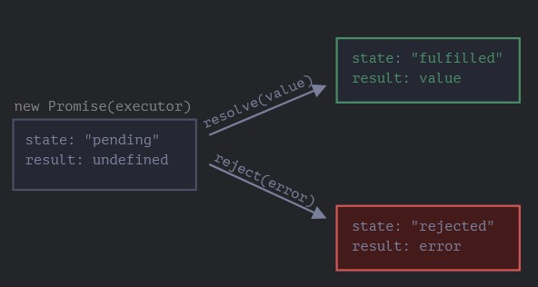

# Promise

Imagine that you're a top singer, and fans ask day and night for your upcoming song.

To get some relief, you promise to send it to them when it's published. You give your fans a list. They can fill in their email addresses, so that when the song becomes available, all subscribed parties instantly receive it. And even if something goes very wrong, say, a fire in the studio, so that you can't publish the song, they will still be notified.

Everyone is happy: you, because the people don't crowd you anymore, and fans, because they won't miss the song.

This is a real-life analogy for things we often have in programming:

1. A "`producing code`" that does something and takes time. For instance, some code that loads the data over a network. That's a "singer".
2. A "`consuming code`" that wants the result of the "producing code" once it's ready. Many functions may need that result. These are the "fans".
3. `promise` is a special JavaScript object that links the "producing code" and the "consuming code" together. In terms of our analogy: this is the "subscription list". The "producing code" takes whatever time it needs to produce the promised result, and the "promise" makes that result availabe to all of the subscribed code when it's ready.

The analogy isn't terribly accurate, because JavaScript promises are more complex than a simple subscription list: they have additional features and limitations. But it's fine to begin with.

The constructor syntax for a promise object is:

```javascript
const promise = new Promise(function(resolve, reject) {
  // executar (the producing code, "singer")
});
```

The function passed to `new Promise` is called the `executor`. When `new Promise` is created, the executor runs automatically. It contains the producing code which should eventually produce the result. In terms of the analogy above: the executor is the "singer".

Its arguments `resolve` and `reject` are callbacks provided by JavaScript itself. Our code is only inside the executor.

When the executor obtains the result, be it soon or late, doesn't matter, it should call one of these callbacks:

* `resolve(value)` - if the job is finished successfully, with result `value`.
* `reject(error)` - if an error occurred, `error` is the error object.

So to summarize: the executor runs automatically and attempts to perform a job. When it is finished with the attempt, it calls `resolve` if it was successful or `reject` if there was an error.

The `promise` object returned by the `new Promise` constructor has these internal properties:

* `state` - initially `"pending"`, then changes to either `"fulfilled"` when `resolve` is called or `"rejected"` when `reject` is called.
* `result` - initially `undefined`, then changes to `value` when `resolve(value)` is called or `error` when `reject(error)` is called.

So the executor eventually moves `promise` to one of these states:



Later we'll see how "fans" can subscribe to these changes.

Here's an example of a promise constructor and a simple executor function with "producing code" that takes time (via `setTimeout`):

```javascript
const promise = new Promise(function(resolve, reject) {
  // the function is executed automatically when the promise is constructed

  // after 1 second signal that the job is done with the result "done"
  setTimeout(function() { resolve("done"); }, 1000);
});
```

We can see two things by running the code above:

1. The executor is called automatically and immediately (by `new Promise`).
2. The executor receives two arguments: `resolve` and `reject`. These functions are pre-defined by the JavaScript engine, so we don't need to create them. We should only call one of them when ready.


This **word** is bold. This <em>word</em> is italic.