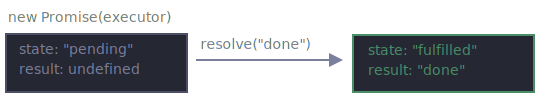
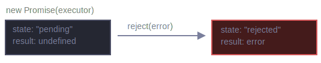

# Promise

Imagine that you're a top singer, and fans ask day and night for your upcoming song.

To get some relief, you promise to send it to them when it's published. You give your fans a list. They can fill in their email addresses, so that when the song becomes available, all subscribed parties instantly receive it. And even if something goes very wrong, say, a fire in the studio, so that you can't publish the song, they will still be notified.

Everyone is happy: you, because the people don't crowd you anymore, and fans, because they won't miss the song.

This is a real-life analogy for things we often have in programming:

1. A "`producing code`" that does something and takes time. For instance, some code that loads the data over a network. That's a "singer".
2. A "`consuming code`" that wants the result of the "producing code" once it's ready. Many functions may need that result. These are the "fans".
3. `promise` is a special JavaScript object that links the "producing code" and the "consuming code" together. In terms of our analogy: this is the "subscription list". The "producing code" takes whatever time it needs to produce the promised result, and the "promise" makes that result availabe to all of the subscribed code when it's ready.

The analogy isn't terribly accurate, because JavaScript promises are more complex than a simple subscription list: they have additional features and limitations. But it's fine to begin with.

The constructor syntax for a promise object is:

```javascript
const promise = new Promise(function(resolve, reject) {
  // executar (the producing code, "singer")
});
```

The function passed to `new Promise` is called the `executor`. When `new Promise` is created, the executor runs automatically. It contains the producing code which should eventually produce the result. In terms of the analogy above: the executor is the "singer".

Its arguments `resolve` and `reject` are callbacks provided by JavaScript itself. Our code is only inside the executor.

When the executor obtains the result, be it soon or late, doesn't matter, it should call one of these callbacks:

* `resolve(value)` - if the job is finished successfully, with result `value`.
* `reject(error)` - if an error occurred, `error` is the error object.

So to summarize: the executor runs automatically and attempts to perform a job. When it is finished with the attempt, it calls `resolve` if it was successful or `reject` if there was an error.

The `promise` object returned by the `new Promise` constructor has these internal properties:

* `state` - initially `"pending"`, then changes to either `"fulfilled"` when `resolve` is called or `"rejected"` when `reject` is called.
* `result` - initially `undefined`, then changes to `value` when `resolve(value)` is called or `error` when `reject(error)` is called.

So the executor eventually moves `promise` to one of these states:

<br>


<br>

Later we'll see how "fans" can subscribe to these changes.

Here's an example of a promise constructor and a simple executor function with "producing code" that takes time (via `setTimeout`):

```javascript
const promise = new Promise(function(resolve, reject) {
  // the function is executed automatically when the promise is constructed

  // after 1 second signal that the job is done with the result "done"
  setTimeout(function() { resolve("done"); }, 1000);
});
```

We can see two things by running the code above:

1. The executor is called automatically and immediately (by `new Promise`).
2. The executor receives two arguments: `resolve` and `reject`. These functions are pre-defined by the JavaScript engine, so we don't need to create them. We should only call one of them when ready.

After one second of "processing", the executor calls `resolve("done)` to produce the result. This changes the state of the `promise` object:

<br>



<br>

That was an example of a successful job completion, a "fulfilled promise".

And now an example of the executor rejecting the promise with an error:

```javascript
const promise = new Promise(function(resolve, reject) {
  // after 1 second signal that job is finished with an error
  setTimeout(function() { 
    reject(new Error("Whoops!")); 
  }, 1000);
});
```

The call to `reject(...)` moves the promise object to `"rejected` state:

<br>



<br>

To summarize, the executor should perform a job (usually something that takes time) and then call `resolve` or `reject` to change the state of the corresponding promise object.

A promise that is either resolved or rejected is called `"settled"`, as opposed to an initially "pending" promise.

> ### There can be only a single result or an error
> 
> The executor should call only one `resolve` or one `reject`. Any state change is final.
> 
> All further calls of `resolve` and `reject` are ignored:
> 
> ```javascript
> const promise = new Promise(function(resolve, reject) {
>   resolve("done");
> 
>   reject(new Error("Error happened...")); // ignored  
>   setTimeout(function() { resolve("OK"); }, 1000);  // ignored
> });
> ```
> 
> The idea is that a job done by the executor may have only one result or an error.
> 
> Also, `resolve` / `reject` expect only one argument (or none) and will ignore additional aguments.


> ### Reject with `Error` object
> 
> In case something goes wrong, the executor should call `reject`. That can be done with any type of argument (just like `resolve`). But it is recommended to use `Error` objects (or objects that inherit from `Error`). The reasoning for that will soon become apparent.


> ### Immediately calling `resolve` / `reject`
> 
> In practice, an executor usually does something asynchronously and calls `resolve`/`reject` after some time, but it doesn't have to. We also can call `resolve` or `reject` immediately, like this:
> 
> ```javascript
> const promise = new Promise(function(resolve, reject) {
>   // not taking our time to do the job
>   resolve(123); // immediately give the result: 123
> });
> ```
> 
> For instance, this might happen when we start to do a job but then see that everything has already been completed and cached.
> 
> That's fine. We immediately have a resolved promise.

> ### The `state` and `result` are internal
> 
> The properties `state` and `result` of the Promise object are internal. We can't directly access then. We can use the methods `.then` / `.catch` / `.finally` for that. They are described below.

## Consumers: then, catch

A promise object serves as a link between the executor (the "producing code" or "singer") and the consuming functions (the "fans"), which will receive the result or error. Consuming functions can be registered (subscribed) using the methods `.then` and `.catch`.

### then

The most important, fundamental one is `.then`.

The syntax is:

```javascript
const { log: print } = console;

const promise = new Promise(function(resolve, reject) {
  let x = 0;
  if (x === 0) {
    reject(new Error("Whoops!... Error"));
  } else {
    resolve({ statusCode: 200 });
  }
});

promise.then(
  function(result) { 
    // handle a successful result
    print(result); 
  },
  function(error) { 
    // handle an error
    print(error.message); 
  }
);
```

The first argument of `.then` is a function that runs when the promise is resolved and receives the result.

The second argument of `.then` is a function that runs when the promise is rejected and receives the error.

For instance, here's a reaction to a successfully resolved promise:

```javascript
const { log: print } = console;

const promise = ne Promise(function(resolve, reject) {
  setTimeout(function() { resolve("done"); }, 1000);
});

// resolve runs the first function in .then
promise.then(
  function(result) { print(result); }, // shows "done" after 1 second
  function(error) { print(error.message); } // doen't run
);
```

The first function was executed.

And in the case of a rejection, the second one:

```javascript
const { log: print } = console;

const promise = new Promise(function(resolve, reject) {
  setTimeout(function() { reject(new Error("Whoops!")); }, 1000);
});

// reject runs the second function in .then
promise.then(
  function(result) { print(result); }, // doesn't run
  function(error) { print(error.message); } // show "Whoops!" after 1 second
);
```

If we're interested only in successful completions, then we can provide only one function argument to `.then`:

```javascript
const { log: print } = console;

const promise = new Promise(function(resolve, reject) {
  setTimeout(function() { resolve("done!"); }, 1000);
});

promise.then(print); // shows "done!" after 1 second
```

### catch

If we're interested only in errors, then we can use `null` as the first argument: `.then(null, errorHandlingFunction)`. Or we can use `.catch(errorHanlingFunction)`, which is axactly the same:

```javascript
const { log: print } = console;

const promise = new Promise(function(resolve, reject) {
  setTimeout(function() { reject(new Error("Whoops!")); }, 1000);
});

// .catch(f) is the same as promise.then(null, f);
promise.catch(print); // shows an Error object after 1 second
```

The call `.catch(f)` is a complete analog of `.then(null, f)`, it's just a shorthand.

## Cleanup: finally

Just like there's a `finally(f)` clause in a regular `try {...} catch {...}`, there's `finally` in promises.

The call `finally(f)` is similar to `.then(f, f)` in the sense that `f` runs always, when the promise is settled: be it resolve or reject.

The idea of `finally` is to set up a handler for performing cleanup/finalizing after the previous operations are complete.

E.g. stopping loading indicators, closing no longer needed connections, etc.

Think of it as a party finisher. No matter was a party good or bad, how many friends were in it, we still need (or at least should) do a cleanup after it.

The code may look like this:

```javascript
const promise = new Promise(function(resolve, reject) {
  // do something that takes time, and the call resolve or
  // maybe reject
});

promise
  // runs when the promise is settled, doesn't matter successfully or not
  .finally(function() { /* stop loading indicator */})
  // so the loading indicator is stopped before we go on
  .then(
    function(result) { /* show result */ },
    function(error) { /* show error */  }
  );
```