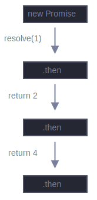
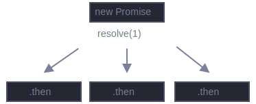

# Promises chaining

Let's return to the problem mentioned in the chapter [Introduction: callbacks](https://javascript.info/callbacks): we have a sequence of asynchronous tasks to be performed one after another - for instance, loading scripts. How can we code it well?

Promises provide a couple of recipes to do that.

In this chapter we cover promise chaining.

It look like this:

```javascript
const { log: print } = console;

new Promise(function(resolve, reject) {
  
  setTimeout(function() { resolve(1); }, 1000); // (*)

}).then(function(result) { // (**)

  print(result); // 1
  return result * 2;

}).then(function(result) { // (***)

  print(result); // 2
  return result * 2;

}).then(function(result) {

  print(result); // 4
  return result * 2;

});
```

The idea is that the result is passed through the chain of `.then` handlers.

Here the flow is:

1. The initial promise resolves in 1 second `(*)`,
2. Then the `.then` handler is called `(**)`, which in turn creates a new promise (resolved with `2` value).
3. The next `.then (***)` gets the result of the previous one, processes it (doubles) and passes it to the next handler.
4. ...and so on.

As the result is passed along the chain of handlers, we can see a sequence of `print` calls: `1` -> `2` -> `4`.

<br>

  

<br>

The whole thing works, because every call to a `.then` return a new promise, so that we can call the next `.then` on it.

When a handler returns a value, it becomes the result of that promise, so the next `.then` is called with it.

**A classic newbie error: technically we can also add many** `.then` **to a single promise.  This is not chaining.**

For example:

```javascript
const { log: print } = console;

const promise = new Promise(function(resolve, reject) {
  setTimeout(function() { resolve(1); }, 1000);
});

promise.then(function(result) {
  print(result);  // 1
  return result * 2;
});

promise.then(function(result) {
  print(result);  // 1
  return result * 2;
});

promise.then(function(result) {
  print(result);  // 1
  return result * 2;
});
```

What we did here is just several handlers to one promise. They don't pass the result to each other; instead they process it independently.

Here's the picture (compare it with the chaining above):

<br>

  

<br>

All `.then` on the same promise get the same result - the result of that promise. So in the code above all `print` show the same: `1`.

In practice we rarely need multiple handlers for one promise. Chaining is used much more often.

## Returning promises

A handler, used in `.then(handler)` may create and return a promise.

In that case further handlers wait until it settles, and then get its result.

For instance:

```javascript
const { log: print } = console;

new Promise(function(resolve, reject) {
  
  setTimeout(function() { resolve(1); }, 1000);

}).then(function(result) {

  print(result);  // 1

  return new Promise(function(resolve, reject) {  // (*)
    setTimeout(function() { resolve(result * 2); }, 1000);
  });

}).then(function(result) {  // (**)

  print(result);  // 2

  return new Promise(function(resolve, reject) {
    setTimeout(function() { resolve(result * 2); }, 1000);
  });

}).then(function(result) {

  print(result);  // 4

});
```

Here the first `.then` show `1` and returns `new Promise(...)` in the line `(*)`. After one second it resolves, and the result (the argument of `resolve`, here it's `result * 2`) is passed on to the handler of the second `.then`. That handler is in the line `(**)`, it shows `2` and does the same thing.

So the output is the same as in the previous example: `1` -> `2` -> `4`, but now with 1 second delay between `print` calls.

Returning promises allows us to build chains of asynchronous actions.

## Example: loadScript

Let's use this feature with the promisified `loadScript`, defined in the [previous chapter](https://javascript.info/promise-basics#loadscript), to load scripts one by one, in sequence:

```javascript
function loadScript(src) {
  return new Promise(function(resolve, reject) {
    const script = document.createElement("script");
    script.src = src;
    script.onload = function() {
      resolve(script);
    }
    script.onerror = function() {
      reject(new Error(`Script load error for ${src}`));
    }
    document.head.append(script);
  });
}

loadScript("./script1.js")
  .then(function(script) {
    return loadScript("./script2.js");
  })
  .then(function(script) {
    return loadScript("./script3.js")
  })
  .then(function(script) {
    // use functions declared in scripts
    // to show that they indeed loaded
    one();
    two();
    three();
  });
```

This code can be made bit shorter with arrow functions:

```javascript
function loadScript(src) {
  return new Promise(function(resolve, reject) {
    const script = document.createElement("script");
    script.src = src;
    script.onload = function() {
      resolve(script);
    }
    script.onerror = function() {
      reject(new Error(`Script load error for ${src}`));
    }
    document.head.append(script);
  });
}

loadScript("./script1.js")
  .then(script => loadScript("./script2.js"))
  .then(script => loadScript("./script3.js"))
  .then(script => {
    // scripts are loaded, we can use functions declared there
    one();
    two();
    three();
  });
```

Here each `loadScript` call returns a promise, and the next `.then` runs when it resolves. Then it initiates the loading of the next script. So scrips are loaded one after another.

We can add more asynchronous actions to the chain. Please note that the code is still "flat" - it grows down, not to the right. There are no signs of the "pyramid of doom".

Technically, we could add `.then` directly to each `loadScript`, like this:

```javascript
function loadScript(src) {
  return new Promise(function(resolve, reject) {
    const script = document.createElement("script");
    script.src = src;
    script.onload = function() {
      resolve(script);
    }
    script.onerror = function() {
      reject(new Error(`Script load error for ${src}`));
    }
    document.head.append(script);
  });
}

loadScript("./script1.js").then(function(script1) {
  loadScript("./script2.js").then(function(script2) {
    loadScript("./script3.js").then(function(script3) {
      // this functions has access to variables script1, script2 and script3
      one();
      two();
      three();
    });
  });
});
```

This code does the same: loads 3 scripts in sequence. But it "grows to the right". So we have the same problem as with callbacks.

People who start to use promises sometimes don't know about chaining, so they write it this way. Generally, chaining is preferred.

Sometimes it's ok to write `.then` directly, because the nested function has access to the outer scope. In the example above the most nested callback has access to all variables `script1`, `script2`, `script3`. But that's an exception rather than a rule.

> ### Thenables
> 
> To be precise, a handler may return not exactly a promise, but a so-called "thenable" object - an arbitrary object that has a method `.then`. It will be treated the same way as a promise.
> 
> The idea is that 3rd-party libraries may implement "promise-compatible" objects of their own. They can have an extended set of methods, but also be compatible with native promises, because they implement `.then`.
> 
> Here's an example of a thenable object:
> 
> ```javascript
> const { log: print } = console;
> 
> class Thenable {
>   constructor(num) {
>     this.num = num;
>   }
>   then(resolve, reject) {
>     print(resolve); // function() { native code }
>     // resolve with this.num * 2 after the 1 second
>     setTimeout(function() {
>       resolve(this.num * 2);
>     }, 1000); // (**)
>   }
> }
> 
> const promise = new Promise(function(resolve, reject) {
>   setTimeout(function() {
>     resolve(1);
>   }, 1000);
> });
> 
> promise
>   .then(function(result) { 
>     return new Thenable(result); // (*) 
>   })
>   .then(print); // shows 2 after 1000ms
> ```
> 
> JavaScript checks the object returned by the `.then` handler in line `(*)`: if it has a callable method named `then`, then it calls that method providing native functions `resolve`, `reject` as arguments (similar to an executor) and waits until one of them is called. In the example above `resolve(2)` is called after 1 second `(**)`. Then the result is passed further down the chain.
> 
> This feature allows us to integrate objects with promise chains without having to inherit from `Promise`.

## Bigger example: fetch

In frontend programming, promises are often used for network requests. So let's see an  extended example of that.

We'll use the [fetch](https://javascript.info/fetch) method to load the information about the user from the remote server. It has a lot of optional parameters covered in [separate chapter](https://javascript.info/fetch), but the basic syntax is quite simple:

```javascript
const promise = fetch(url);
```

This makes a network request to the `url` and returns a promise. The promise resolves with a `response` object when the remote server responds with headers, but before the full response is downloaded.

To read the full response, we should call the method `response.text()`: it returns a promise that resolves when the full text is downloaded from the remote server, with that text as a result.

The code below makes a request to `user.json` and loads its text from the server:

```javascript
const { log: print } = console;

fetch("./user.json")
  // .then below runs when the remote server responds
  .then(function(response) {
    // response.text() returns a new promise that resolves with the full response text when it load
    return response.text();
  })
  .then(function(text) {
    // ...and here's the content of the remote file
    print(text);  // { "id": "1", "firstName": "zelito", "lastName": "abdala", "age": 12 }
  })
```